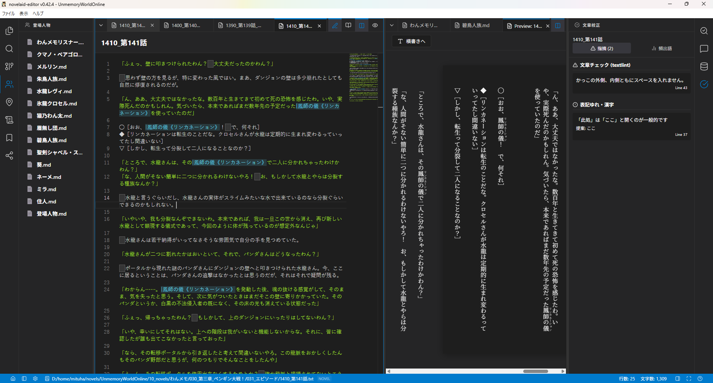
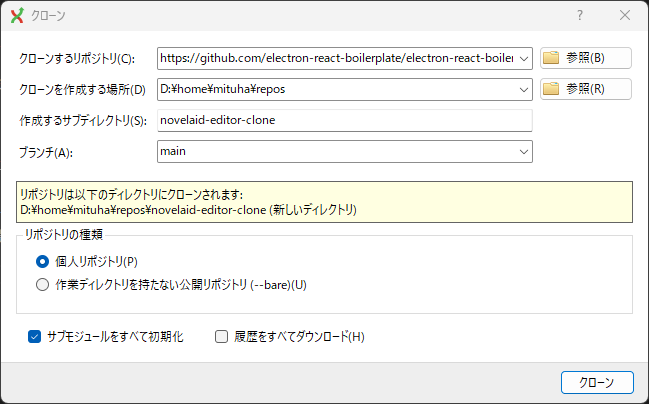
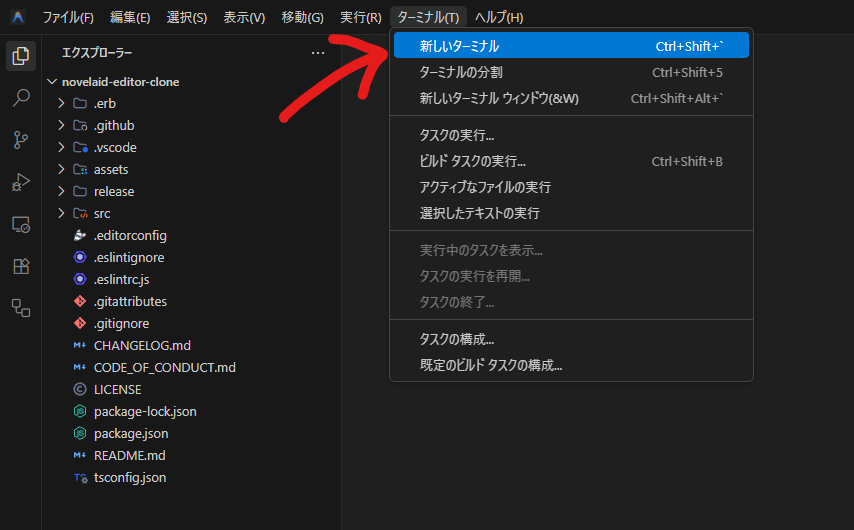
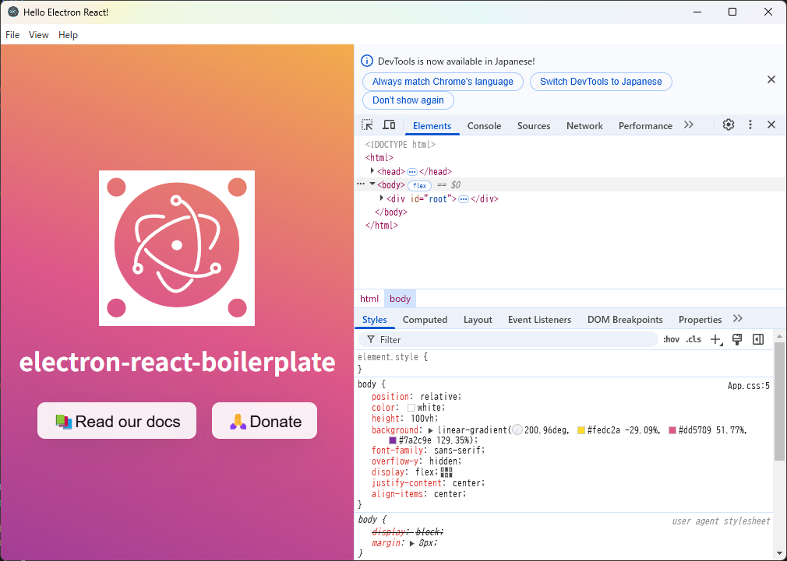
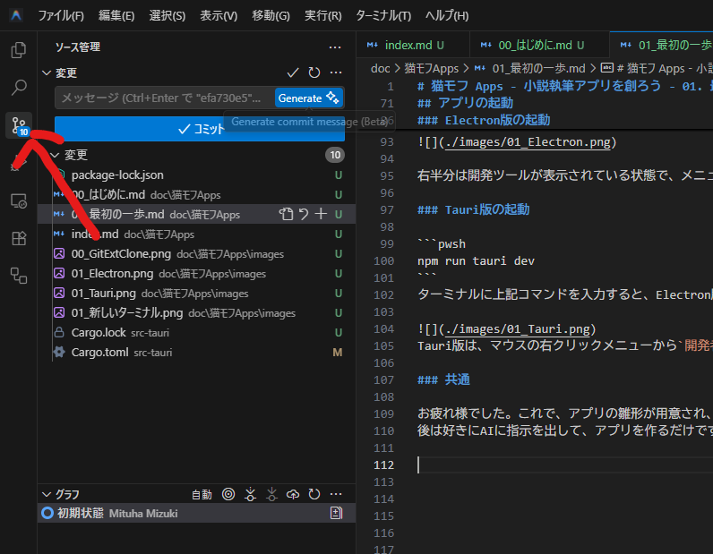
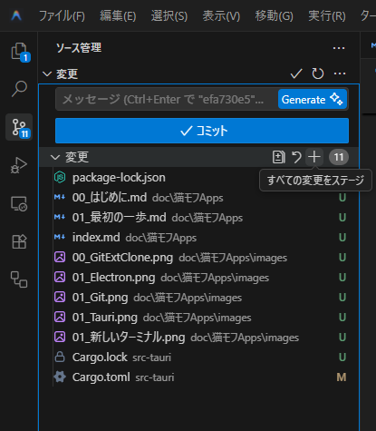
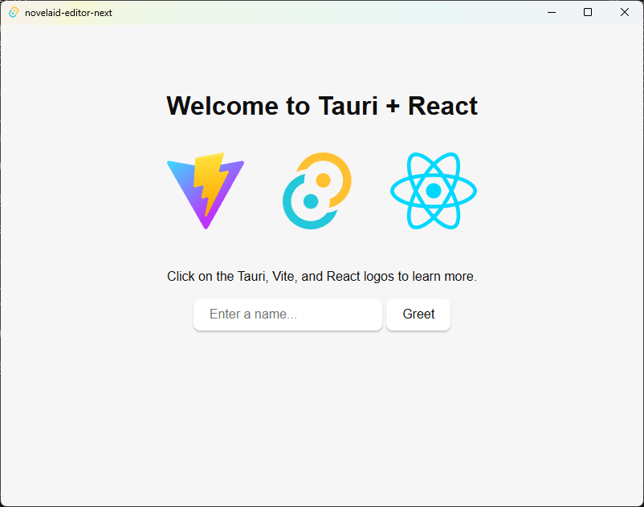

# 猫モフ Apps - 小説執筆アプリを創ろう - 01. 最初の一歩


猫モフ Apps は、猫をモフモフしながら思いついたアイデアを、バイブコーディングでゆるっと創っていく企画です。  

前回で開発環境関連のインストールは終わっているものとして、今回は実際にアプリを作成していきます。

## 作成するものについて

  

作成するのは、このような小説執筆アプリ、[novelaid-editor](https://mituha.github.io/novelaid-editor/)のクローンです。  
制作の過程で各自の好みに合わせてカスタマイズしてください。

アプリとしては、次の２つを作成します。

1. novelaid-editor-clone
    + Electron + TypeScript + React
    + 以下、Electron版
2. novelaid-editor-next 
    + Tauri + TypeScript + React + Rust
    + 以下、Tauri版
    + なお、このTauri版は、MORE以降の有料記事で作成

となります。  

novelaid-editor-clone は、元の novelaid-editor を再現するもので、Electron で動くアプリなのは代わりません。  
novelaid-editor-next は、折角なので Tauri で動くアプリにしてみようという試みです。  
並行して進めれば実装としては元のアプリを含めて３つの実装があることになり、まあ、見比べれば違いが分かって面白いんじゃないかなと思います。　　

## プロジェクトの作成

なお、以降の`novelaid-editor-clone`、`novelaid-editor-next`のアプリ名は適宜好みのものに読み替えて下さい。


[Electron](https://www.electronjs.org/ja)のサイトにチュートリアルもありますが、今回は[Electron React Boilerplate](https://github.com/electron-react-boilerplate/electron-react-boilerplate) を使って作成します。  
素のElectronで作成しても良いのですが、流石に敷居が高いので、雛形となるリポジトリを使います。

```pwsh
git clone --depth 1 --branch main https://github.com/electron-react-boilerplate/electron-react-boilerplate.git novelaid-editor-clone
```

プロジェクトを作成したいフォルダーで、上記のコマンドを実行します。  
Git Extensions を使う場合、マウスの右クリックメニューから「GitExt Clone...」を選びます。
  
履歴をすべてダウンロードのチェックを外せば、コマンドの`--depth 1`と同じ効果があります。

なお、この時点ではこのプロジェクトは元となった`electron-react-boilerplate`と紐づいているため、リモートリポジトリを切り離す必要があります。  
フォルダー内に、`.git`というフォルダーが作成されているはずですので、このフォルダーを削除してください。
これで、リポジトリ自体の管理がされていない状態となります。
次に左端のGit用のソース管理のボタンをおして、ソース管理パネルに切り替えて下さい。  
ソース管理(Git)の初期化が行われていない扱いにもどっているので、`リポジトリを初期化する`のボタンを押して初期化して下さい。  

ここまでで、プロジェクト用のフォルダーが作成され、プロジェクトの雛形が用意されました。  
次は実際にアプリを起動してみます。

## アプリの起動

まずは、開発環境である Antigravity を起動し、作成したプロジェクト(フォルダー)を開きます。

  

ターミナルが表示されていない場合、メニューの「ターミナル」→「新しいターミナル」から表示してください。  

```pwsh
npm install
```
ターミナルに上記コマンドを入力することで、依存ライブラリのダウンロードが始まります。
最初はそれなりに時間がかかりますので、猫をモフモフしながら待っていて下さい。
なお、この`npm install`は、Electron版、Tauri版、両方で同じです。

```pwsh
npm start
```
ターミナルに上記コマンドを入力すると、ずらずらと何やら表示されて、アプリが起動します。  

  

右半分は開発ツールが表示されている状態で、メニューの`View -> Toggle Developer Tools`で消すことができます。

お疲れ様でした。これで、アプリの雛形が用意され、アプリを起動することができるようになりました。
後は好きにAIに指示を出して、アプリを作るだけですが、その前にもう一つだけやっておくことがあります。  

  

左端のGit用のソース管理のボタンをおして、ソース管理パネルに切り替えて下さい。  
Electron版は変更部分に`package-lock.json`が表示されている状態になっていると思います。  
Tauri版はソース管理(Git)の初期化が行われていないので、`リポジトリを初期化する`のボタンを押して初期化して下さい。  

  

次に、`変更`の横の`+`ボタンを押して、変更をステージングします。  
入力欄に`最初のコミット`等と入力して、`コミット`ボタンを押します。  

これで、変更内容の保存が完了です。  

次回は、実際にAIに指示を出して、アプリを作っていきます。

# MORE

これ以降はTauri版、および、プログラマー寄りの補足的な内容となっています。  

## 前提

Electron版の記事を読んだ上での比較および補足説明になります。
また、VSCode(Antigravity)等の使用方法はそれなりに分かっている読者を想定しています。  
多分解説しないこと。

* VSCode(Antigravity)の使用方法
* gitの使用方法

基本的に私(筆者)が知っているレベルのプログラミング関連の説明は書きません。  
逆に、`Node.js`、`TypeScript`、`React`、`Rust`等のWEB関連技術等は私が分かっていない、また、バイブコーディングで適当に処理しているため、再確認のためにメモっていく予定です。  

これらの技術的な内容については、作業を進める上で後日判明した内容等を随時、追加、修正を行う場合があります。  


## プロジェクトの作成(Tauri版)

[Tauri](https://tauri.app/ja/)版はサイトのチュートリアル通りのインストールでも問題ありません。

```pwsh
npm create tauri-app@latest
```
プロジェクトを作成したいフォルダーで、上記のコマンドを実行します。  

```pwsh
✔ Project name · novelaid-editor-next
✔ Identifier · jp.restar.novelaid-editor-next
✔ Choose which language to use for your frontend · TypeScript / JavaScript - (pnpm, yarn, npm, deno, bun)
✔ Choose your package manager · npm
✔ Choose your UI template · React - (https://react.dev/)
✔ Choose your UI flavor · TypeScript
```
途中幾つか質問されますが、上記のように選択します。  
プロジェクト名等は適宜好みのものに変えて下さい。  

Electron版より圧倒的に簡単に始められると言えます。  
実際、どちらを初心者に勧めるべきかは悩むところです。  
場合によっては、この記事もTauri版のみにする可能性もあります。  


## アプリの起動(Tauri版)

```pwsh
npm install
npm run tauri dev
```
ターミナルに上記コマンドを入力すると、Electron版同様、ずらずらと何やら表示されて、アプリが起動します。  

  
Tauri版は、マウスの右クリックメニューから`開発者ツールで調査する`を選択すると、開発ツールが表示されます。  

## GitHub

* [novelaid-editor](https://github.com/mituha/novelaid-editor)
    + オリジナルとなる`novelaid-editor`はここで公開しています。
* `novelaid-editor-clone`
    + Electron版
    + TODO 公開したら更新します
* `novelaid-editor-next`
    + Tauri版
    + TODO 公開したら更新します
    + この記事(有料部分含む)も含まれています


