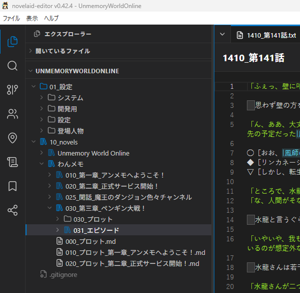
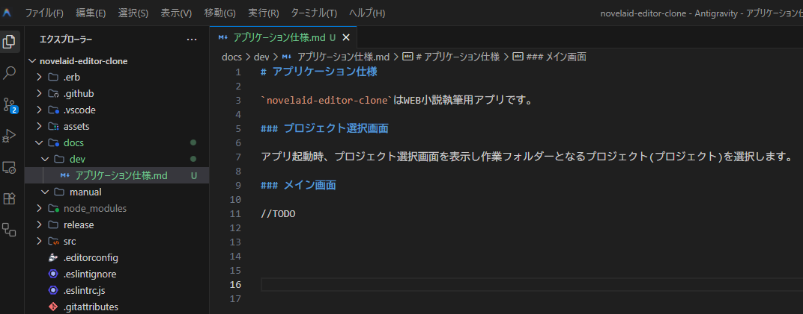
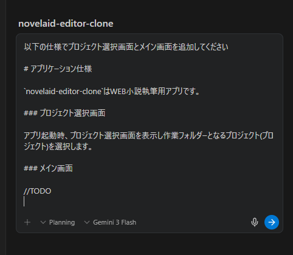
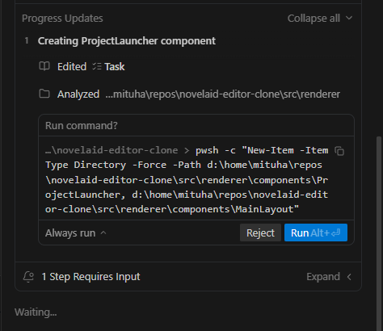
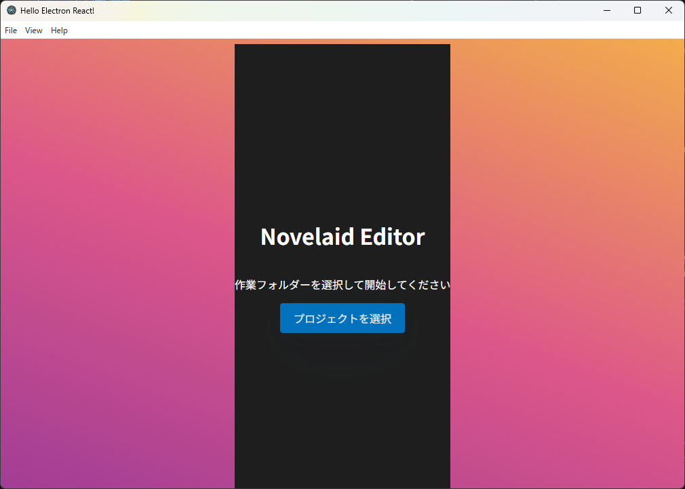
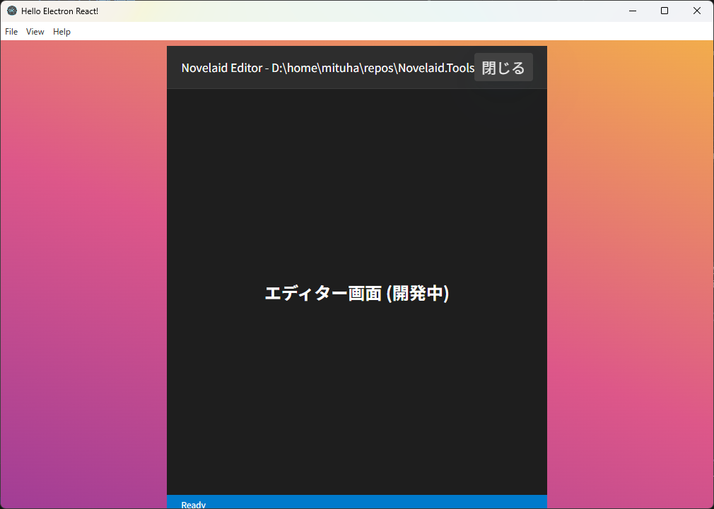

# 猫モフ Apps - 小説執筆アプリを創ろう - 02. プロジェクト選択


猫モフ Apps は、猫をモフモフしながら思いついたアイデアを、バイブコーディングでゆるっと創っていく企画です。  


前回は実際にアプリが起動するところまででした。  
今回からは`novelaid-editor`の機能を確認しつつ、自分専用の小説執筆アプリを作成していきます。

## どのようなアプリにしたいか

まずは、今現在どのような執筆スタイル、アプリを使用して執筆をしているかから確認していきます。  
私の場合、執筆用のエディターとしては、

* VSCode + novel-writer
* Obsidian + 自作プラグイン

のような環境で執筆をしていました。  

VSCodeは、当初は良かったのですが、エピソード数が多くなったあたりからソフトが重くなって作業に支障が出てくるようになりました。  
これは、VSCodeを執筆以外のプログラミング環境としても使用している弊害かもしれません。  

そこで、Obsidianに乗り換え、自作のプラグインを作成して執筆環境を構築しました。  
これは、特に設定用のファイルの扱いについては中々良く、執筆環境としての不満はなかったのですが、プラグインを自作する上での情報不足や触れない部分に不満がありました。

このような事情から、じゃあ、自分専用の小説執筆アプリを創ろうとなったわけです。  

つまるところ、今までの執筆環境自体にそれほど不満があったわけではありません。  
そのため、作成するアプリも、今までの環境をベースに、VSCode+Obsidianのイメージで作成されています。

では、実際にどのようなアプリになっているか見ていく前に、私の執筆環境でのフォルダー構成を見てみます。

　　

小説用のフォルダー構成は以下のようになっています。

```
UnmemoryWorldOnline
├─01_設定
│  ├─登場人物
│  │  ├─images
│  │  └─わんメモ
│  └─設定
│     ├─地理
│     ├─歴史
│     └─用語
└─10_novels
    ├─Unmemory World Online
    └─わんメモ
        ├─010_第一章_アンメモへようこそ！
        ├─020_第二章_正式サービス開始！
        ├─025_閑話_魔王のダンジョン色々チャンネル
        └─030_第三章_ペンギン大戦！
            ├─030_プロット
            └─031_エピソード
```
フォルダー構成をどうするかは試行錯誤中ですが、まず、作業フォルダーの中を設定用と小説用に分けています。  
小説フォルダーの中には２つの小説用のフォルダーがあります。  
小説を書く場合に何を起点に書くかと考えた場合に、私の場合は設定(世界観)から始めることが多いです。  
そこで、作業フォルダーは世界観でまとめるようにしており、この場合は同じ世界観の中に２つの小説用のフォルダーがあります。  

このように、この小説執筆アプリではフォルダー単位で管理して作業を行います。  
そのため、アプリ起動時にはプロジェクトとしてフォルダー選択画面が表示されます。

　　

機能としては、

* 既存のフォルダを開く
* 新しい書庫を作成
    + フォルダーを作成
    + gitのリポジトリからクローン
* 最近使った書庫

があるみたいです。  
私の場合、「既存の書庫を開く」か「最近使った書庫」の機能しか使用していないので、今現在、他の機能が動作するかわかりません……。  

ともかく、小説執筆アプリを作成するにあたって必要なのはフォルダー選択機能ということが分かりましたので、作業フォルダーを選択する部分から作成していきます。  

## プロジェクト選択をつくろう

では早速、AIとチャットして……とする前に、簡単に仕様を作成するところから始めてみます。  
ほら、小説を書く時もプロットから作成するでしょう？  
ちなみに、私はプロットも仕様書も書かずに作業しています。  

この行き当たりばったりを反省して手順を書き残しながら作業をするのもこの記事を書いている目的の一つです。

というわけで、`doc/dev` フォルダーに `アプリケーション仕様.md` というファイルを作成し、次のように書きました。

  

```markdown
# アプリケーション仕様

`novelaid-editor-clone`はWEB小説執筆用アプリです。  

### プロジェクト選択画面

アプリ起動時、プロジェクト選択画面を表示し作業フォルダーとなるプロジェクト(プロジェクト)を選択します。

### メイン画面

//TODO

```

こうやって仕様を文章に残していくことは必要だと思います。  
Antigravityはプロジェクト内のファイルを読みにいくので多分仕様があったほうが良いです。  

下準備も済んだところで、やっと作業を開始します。  
AIに対してこの仕様で作成してもらうわけですが、一番分かりやすい方法でチャットのやり取りとして指示してみます。  

  

> 以下の仕様でプロジェクト選択画面とメイン画面を追加してください
>
> ※ Shift+Enterで改行できるので、「アプリケーション仕様.md」の内容をコピペ
>
> ### プロジェクト選択画面
> 
> アプリ起動時、プロジェクト選択画面を表示し作業フォルダーとなるプロジェクト(プロ...

右側のAgent画面に上記を入力し、Enterかボタンで送信してください。  
AI君が色々解析して実施計画を立ててくれます。  

  

うん、英語ですね。「プランを日本語にして」と言えば日本語にしてくれます。  
また、プランに対して修正のためのコメントを入れたりもできます。  

  

作成される名前を若干変更しておきました。  

* ProjectSelector => ProjectLauncher
* MainEditor => MainLayout

これは、分かりやすさからと、オリジナルの`novelaid-editor`の名称を参考にしています。  
ついでに、先程書いたアプリケーション仕様の方にも書き足しておきます。  

```markdown
...(略)

### プロジェクト選択画面(ProjectLauncher)

アプリ起動時、プロジェクト選択画面を表示し作業フォルダーとなるプロジェクト(プロジェクト)を選択します。

### メイン画面(MainLayout)

...(略)
```

では、作業を進めてもらいます。  
チャット欄に「実装して」などと入れるか、プラン画面右上の「Proceed」ボタンを押せば実装が開始されます。  

しばらくして、作業を続けていたAI君に呼ばれました。

   

「コマンドを実行するけど良い？」ということです。  
今回は、`New-Item -ItemType Directory`のコマンドで、ディレクトリ作成するってことらしいので、Runボタンで許可して実行してもらいます。

  

更に実装が進み、`Walkthrough`(作業報告)が表示されたら完了です。  

なお、右下にずらずらっと見えているのは各ファイルの変更点です。  
とりあえずは`Accept all`ボタンを押してください。gitを導入していれば、gitの方でも確認できます。  

では、出来上がったアプリを実行してみます。

```pwsh
npm start
```

ターミナル画面で`npm start`と入力し、しばらく待ってアプリが起動したら成功です。  

  
  

プロジェクト(フォルダー)選択からメイン画面が開くことが確認できました。  


# MORE

これ以降はTauri版、および、プログラマー寄りの補足的な内容となっています。  

## プロジェクト選択をつくろう(Tauri版)

Electron版同様、仕様を書いてからAIに作業をしてもらいます。  
なお、Electron版での修正を反映させた状態の仕様を渡します。

```markdown
# アプリケーション仕様

`novelaid-editor-next`はWEB小説執筆用アプリです。  

### プロジェクト選択画面(ProjectLauncher)

アプリ起動時、プロジェクト選択画面を表示し作業フォルダーとなるプロジェクト(プロジェクト)を選択します。

### メイン画面(MainLayout)

//TODO
```

なお、オリジナルの`novelaid-editor`を参考にしてと伝えると更に近い形で作成してくれました。  
が、今回の記事や比較用に適さなかったのでそれらの文言は含めていません。  
同じAntigravityで開発しているため、ローカル情報が共有されているのか、それとも、GitHubの方の[novelaid-editor](https://github.com/mituha/novelaid-editor)を参考にしたのかは不明です。  
近いものを作りたい場合は参照してみて下さい。  
いや、それならむしろ、`git clone`して改造したほうが良いのでは？  


