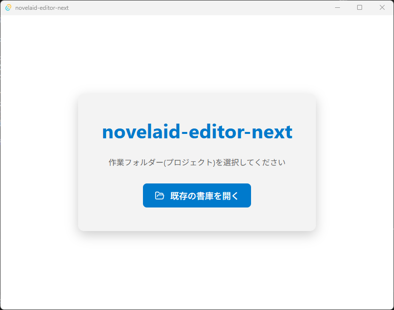
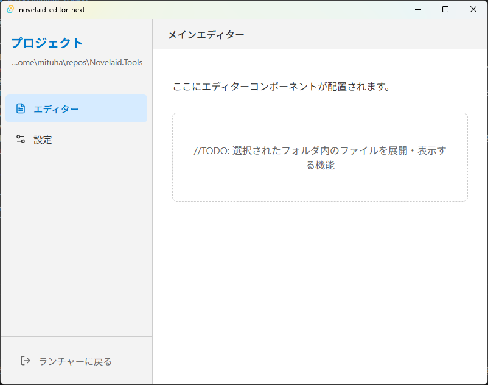
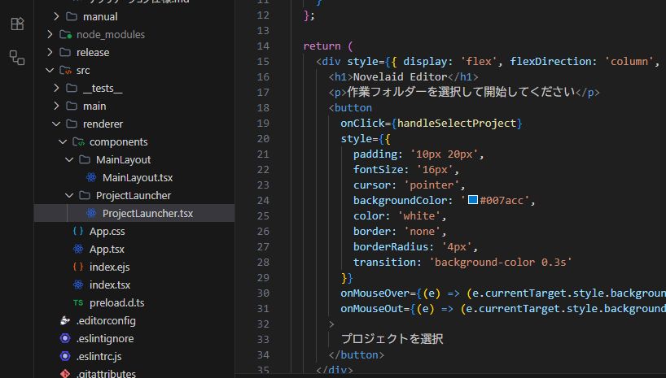
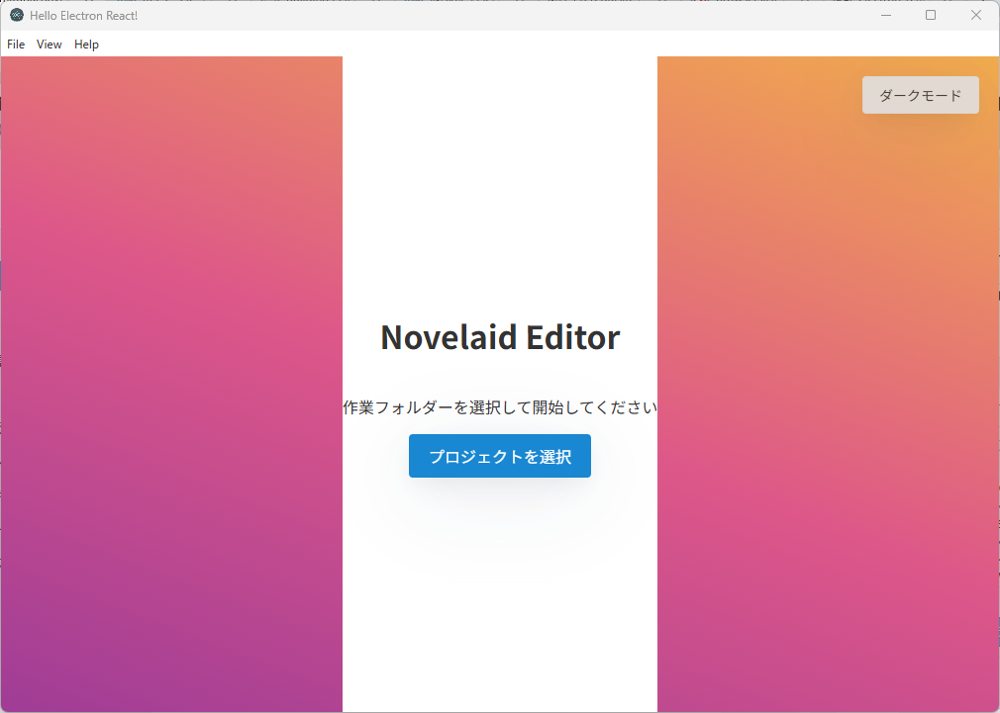
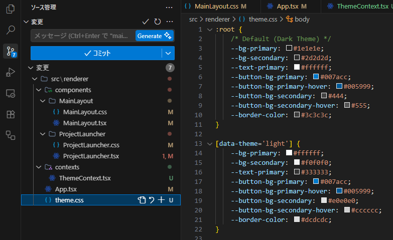
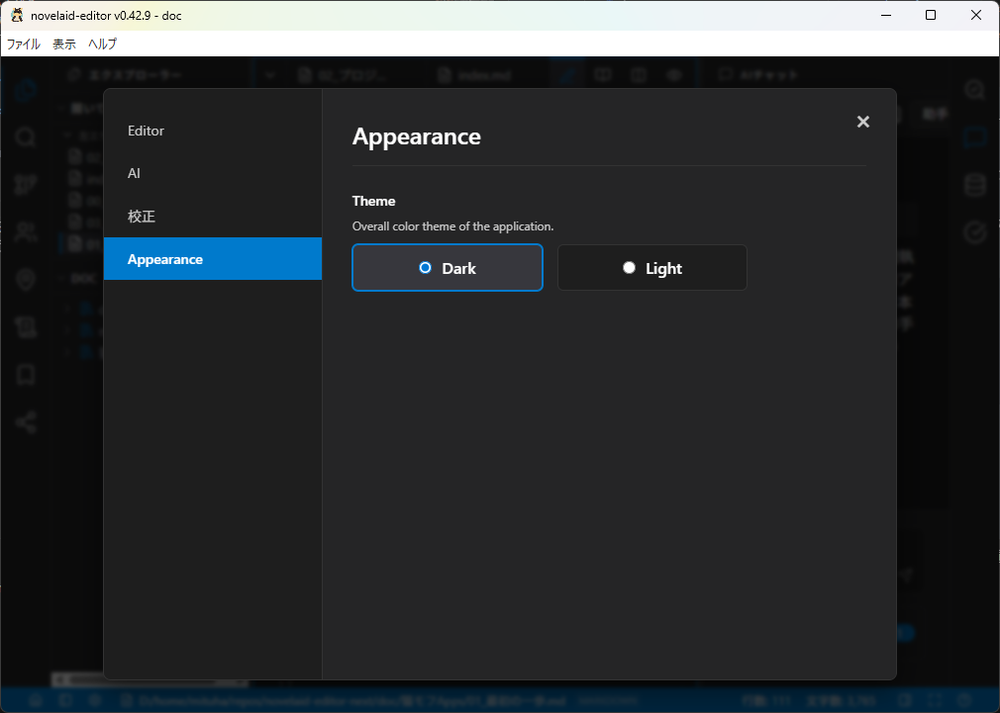
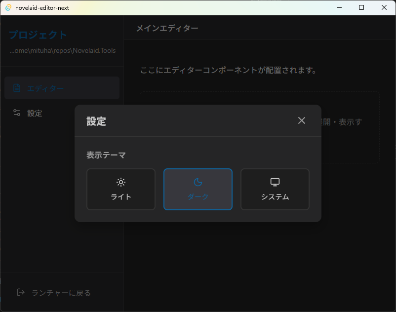

# 猫モフ Apps - 小説執筆アプリを創ろう - 03. 表示テーマ


猫モフ Apps は、猫をモフモフしながら思いついたアイデアを、バイブコーディングでゆるっと創っていく企画です。  

前回はプロジェクト選択画面とメイン画面を作成しました。  
今回は前回気になったところを修正しつつ、表示テーマを切り替える機能を追加します。

## 表示周りの機能

まず、前回作成されたアプリを確認してみます。

  
  
これがElectron版です。

  
  
これがTauri版です。

同じプロンプトで作成したのにTauri版の方が良さげです。  
皆さんの環境ではどうでしょうか？  
今回はある程度似たようなUIに調整しつつ、テーマ切り替え対応まで入れたいと思います。

まず、プログラムの構造的な問題から調整します。

   

`App.tsx`、`App.css`のように、ReactではコンポーネントごとにCSSを管理することが多いです。
それに対し、`MainLayout.tsx`ではcssが分離されていません。  

この後、テーマ切り替え機能を追加するにあたって、cssを分離されていたほうが管理しやすいこともあり、軽く分離してもらいます。
「MainLayout.tsxとProjectLauncher.tsxのcssを分離して」と指示することで、簡単に分離できました。  
修正後は忘れずにコミットしてください。  

次にテーマ対応ですが、仕様に書いてからでも良いのですが、AI君に裁量に任せて実装してみす。
「テーマ切り替え機能を追加して」と簡単に丸投げしてみます。

  

今回は実施計画も出さずにいきなり実装されました。  
設定変更部分は右上に切り替えボタンが付く簡単なものとなっています。  

    

ソースの変更点としては、`theme.css`が追加され、ThemeContextが作成されています。  
ReactのContextは、コンポーネント間で状態を共有するための仕組みらしいです。  
修正が終わったところで、アプリケーション仕様に実装された仕様を追加しておきます。

```markdown

## テーマ切り替え

`theme.css`、および、`ThemeContext.tsx`で管理します。

```

ちなみにオリジナルの`novelaid-editor`のテーマ切り替え部分は、設定画面の中にあります。  

  

なお、ライトモードに切り替えても対応されていない部分が多くありましたので、順に調整します。  
また、オリジナルでは`ThemeContext`のような仕組みは持っていなかったのでそちらも修正しようと思います。

## まとめ

目に優しいダークモードに変更できたので、次回からはメイン画面での作業に移っていきます。

# MORE

これ以降はTauri版、および、プログラマー寄りの補足的な内容となっています。  


## テーマ切り替え(Tauri版)

```markdown
## テーマ切り替え部分のリファクタリング
現在、App.css等で扱われている部分を
`theme.css`、に分離し、切り替えや管理を、`ThemeContext.tsx`で行うように独立性を高めて下さい
```
Electron版での結果を考慮し、上のようなプロンプトで修正。
中身的にはほぼ同じですが、`dark`、`light`の他に、`system`がある模様。

なお、`ThemeContext`の仕組みはできたものの、設定部分がないため、この時点では切り替えは出来ませんでした。  

流石に困るので、テーマ切り替え設定を追加してもらいました。

  

メイン画面の方でもダミーだった設定ボタンが動作するようになっています。


