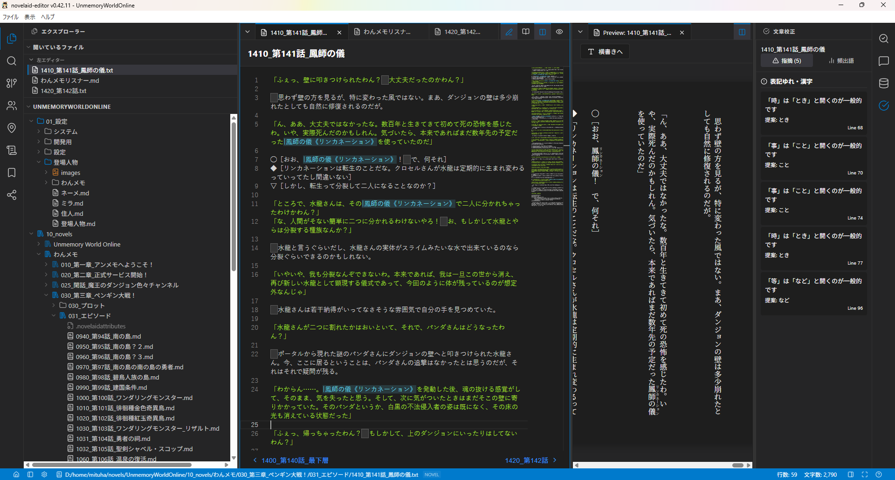
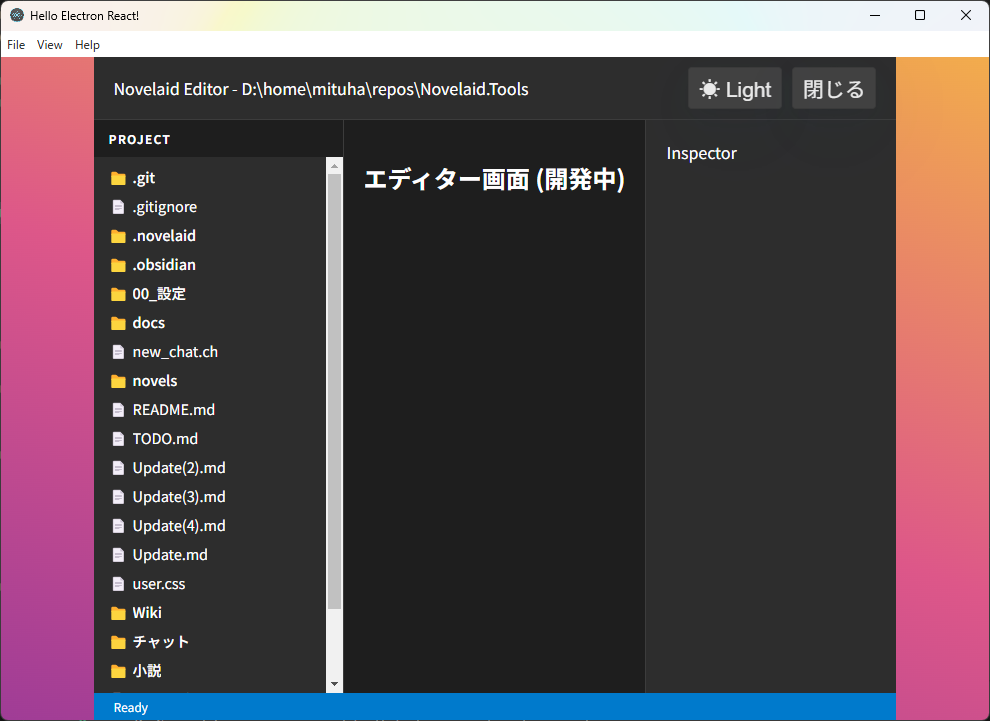
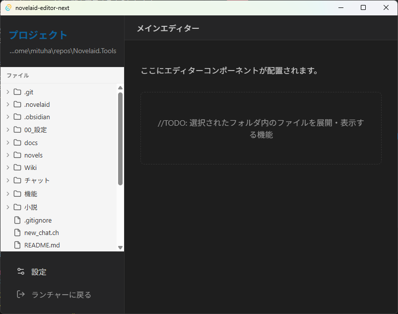

# 猫モフ Apps - 小説執筆アプリを創ろう - 03. 表示テーマ


猫モフ Apps は、猫をモフモフしながら思いついたアイデアを、バイブコーディングでゆるっと創っていく企画です。  

前回は少し寄り道してテーマ切り替えを追加しました。
今回からはメイン画面の作成に入ります。

## メイン画面

  

オリジナルのメイン画面を確認すると上図のようなメイン画面になっています。  
言葉で書くと、

```markdown

### メイン画面(MainLayout)

メイン画面はVSCodeに近い形で、固定配置となり以下の領域に分かれます。

* 上部：メインメニュー
* 中央
    + 左側：左ペイン
    + 中央：ドキュメントビューエリア
    + 右側：右ペイン
* 下部：ステータスバー

これらの領域は表示有無の切り替えはありますが、配置は固定とします。
左右のペインは更に複数のパネルを表示することができます。

```

のような感じでしょうか。  
これを、`アプリケーション仕様.md` に記載しておきます。  

まず、左ペインにファイル一覧を表示するようにします。  
なにはともあれ、ファイルが開けないと執筆ができません。

「左ペインにファイル一覧を表示するようにして」と指示してみます。



無事に表示できました。
空っぽのフォルダーでは何も表示されないため、とりあえずテスト用のフォルダーを開いています。  

## まとめ


# MORE

これ以降はTauri版、および、プログラマー寄りの補足的な内容となっています。  


## ファイル一覧(Tauri版)

やることはElectron版とほぼ同じです。  
`アプリケーション仕様.md` にレイアウト関連を記載して、「左ペインにファイル一覧を表示するようにして」と指示します。  



