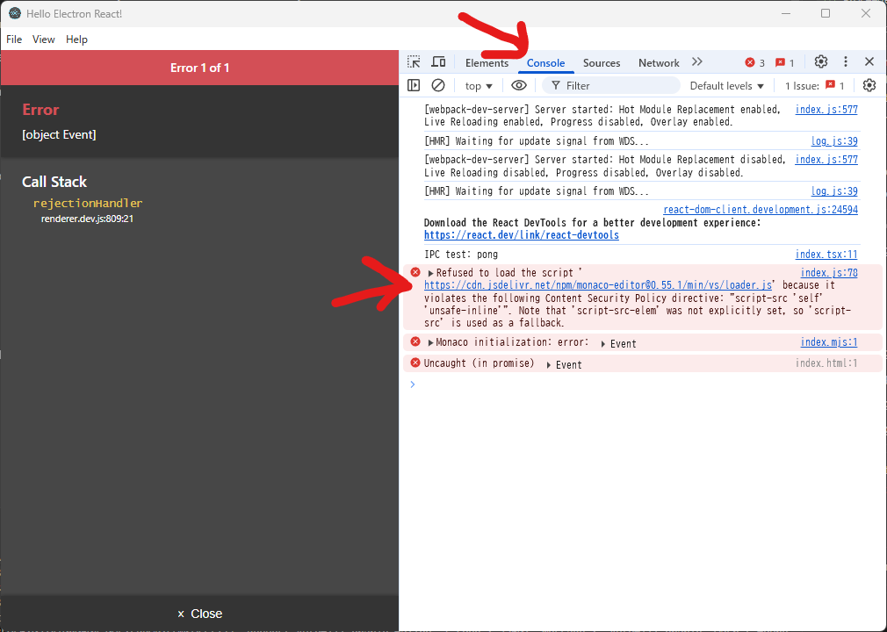
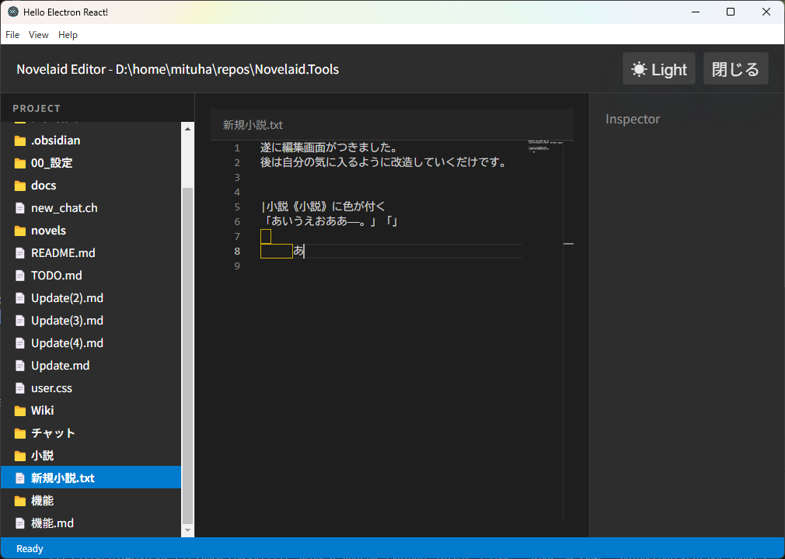
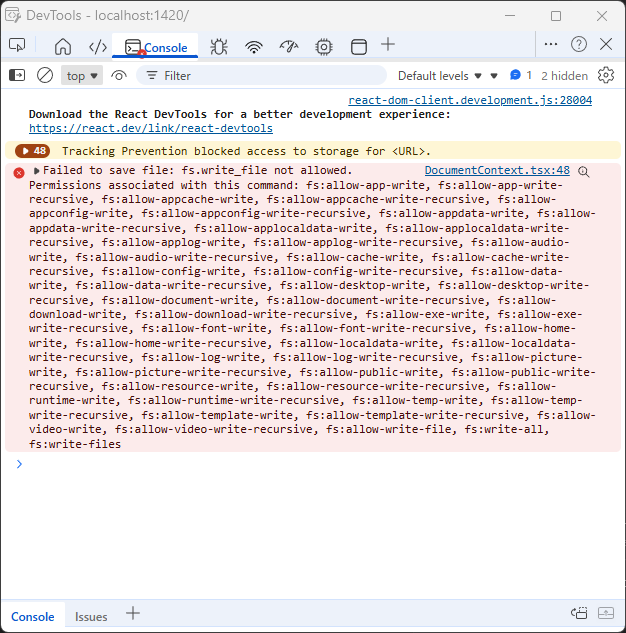

# 猫モフ Apps - 小説執筆アプリを創ろう - 05. エディター


猫モフ Apps は、猫をモフモフしながら思いついたアイデアを、バイブコーディングでゆるっと創っていく企画です。  

前回まででファイル一覧が実装できました。
次は実際に小説を執筆する画面の追加です。

## エディター画面

  

オリジナルのエディター画面、どこかで見たことがあるような画面ですね。  
そう、今アプリを作成している`Antigravity`のエディター部分とそっくりです。  
このエディター部分は、`Antigravity`の元となっている`VSVode`のエディター部分の[Monaco Editor](https://microsoft.github.io/monaco-editor/)を使用しています。

まずは、これまでと同じように、`アプリケーション仕様.md`にエディター画面の仕様を追記します。  
その後、AI君に作成をお願いします。

```markdown

以下の仕様でエディター画面を作成して下さい。

### エディター画面

選択したファイルを表示、編集することができます。  
エディター画面は、`Monaco Editor`を使用します。  

```

サクサクと`monaco-editor`、`@monaco-editor/react`をインストールして、エディター画面作成のための作業が完成しました。

  

おおっと！　ファイルを選択したらエラーが出てしまいました。  
少しエラーメッセージを確認してみます。  
`Developer Tools`の`Console`タブを確認すると、`Refused to load the script`と表示されています。  
このブロックの内容をコピーして、チャットに貼り付けます。

```
index.js:78 Refused to load the script 'https://cdn.jsdelivr.net/npm/monaco-editor@0.55.1/min/vs/loader.js' because it violates the following Content Security Policy directive: "script-src 'self' 'unsafe-inline'". Note that 'script-src-elem' was not explicitly set, so 'script-src' is used as a fallback.
```

解決を丸投げしたのですが、`index.ejs`のmeta部分を修正してくれました。  

```html
<!DOCTYPE html>
<html>

<head>
  <meta charset="utf-8" />
  <meta http-equiv="Content-Security-Policy"
    content="script-src 'self' 'unsafe-inline' 'unsafe-eval' https://cdn.jsdelivr.net blob: data:;" />
  <title>novelaid-editor</title>
</head>

<body>
  <div id="root"></div>
</body>

</html>
```

これで無事にエディター画面が表示されました。  

   

`Ctrl+S`で保存もされます。  

### エラーがでたら

「動作しませんでした」とAIに伝えるだけでも修正してくれたりもします。  
しかし、修正自体がドツボにはまることもよくあります。  
なるべく、怪しそうなエラーメッセージをコピーして、AIに修正を依頼するようにしましょう。  

実はElectornの場合、内部的にはフロントエンドとバックエンドが分かれています。  
フロントエンド側のエラーは`Developer Tools`の`Console`タブで確認できます。
バックエンド側のエラーは`npm start`を入力したターミナルで確認できます。  

また、エラー内容を`Antigrabity`に貼り付けて修正を依頼する前に、外部で別のAIに内容を確認したり、日本語に翻訳するなどしてある程度理解しながら修正を進めると上手くいきやすいです。

## まとめ

今回で小説を執筆できる環境が整いました！  

「えっ、まだまだじゃね？」と思った方は、そのまだまだな部分の改造を進めて下さい。 
きっと自分好みの自分専用の小説執筆アプリが出来上がるでしょう。  


# MORE

これ以降はTauri版、および、プログラマー寄りの補足的な内容となっています。  


## エディター画面(Tauri版)

やることはElectron版とほぼ同じです。  
早速出来上がった画面を見てみましょう。

  

すんなりと出来上がっているように見えます。  
しかし、`Ctrl+S`で保存しても保存されていませんでした。  

どうして保存が出来なかったかをElectron版と同じように`Developer Tools`で確認してみます。  

Tauri版も、Electron版と同じようにフロントエンドとバックエンドが分かれています。  
今回、バックエンドにRustを使用しているため、Tauri版は初心者向けになりづらいかな、と予想していたのですが、現状はRust側の処理がほぼなく、Tauri版だけで良かったかも、という状態です。

Tauri版の`Developer Tools`ですが、`Ctrl+Shift+I`で開くことが出来ます。

### エラーが出たら(Tauri版)

Tauri版の`Developer Tools`ですが、`Ctrl+Shift+I`で開くことが出来ます。  
別ウィンドウで表示されます。  
レイアウト確認の場合はElectron版よりも使い勝手は良いかもしれません。  

  

`Failed to save file: fs.write_file not allowed. Permissions associated with this command: fs:allow...` と表示されています。  
ファイルの書き込み権限がないエラーのようです。  
Tauri版では`src-tauri/capabilities/default.json`で権限を管理されており、割とこの手のエラーが出ることが多いです。

なお、権限を変更した場合は、ターミナルでの動作を一度停止(Ctrl+C)してから、再度`npm run tauri dev`を実行する必要があります。  


