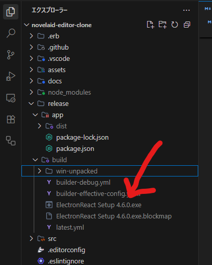
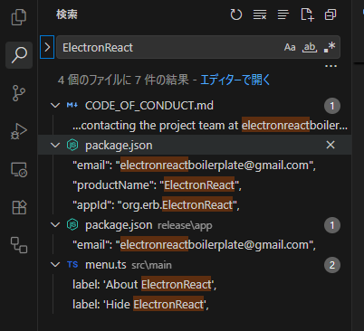
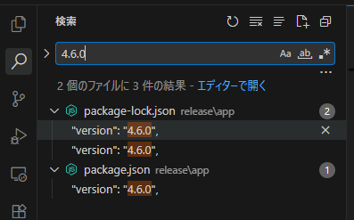
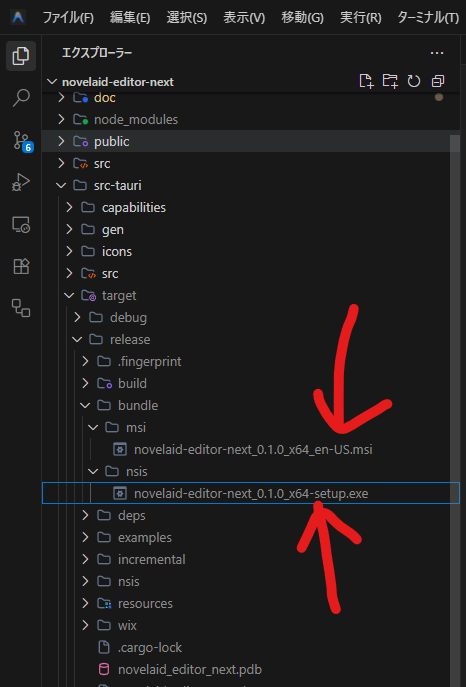

# 猫モフ Apps - 小説執筆アプリを創ろう - 06. 実行ファイルの作成


猫モフ Apps は、猫をモフモフしながら思いついたアイデアを、バイブコーディングでゆるっと創っていく企画です。  

前回まで最低限機能する小説執筆アプリが完成しました。  
ここからは好きに改造するフェーズですが、その前に開発環境からの動作ではなく、実行ファイルの作成方法などを確認します。  

## 実行ファイルの作成

ターミナル画面で次のコマンドを入力します。  

```pwsh
npm run package
```

ずらずらっと処理が始まり、最終的には`release/build/novelaid-editor-0.0.1-x64.exe`という名前のインストーラーが出来上がります。  

  

インストーラーが出来上がったのは良いのですが、この`ElectronReact`という名前と`4.6.0`というバージョン番号は、どこからきたのでしょう？  
わからない時は検索してみます。  


  

このElectron版のアプリは[Electron React Boilerplate](https://github.com/electron-react-boilerplate/electron-react-boilerplate)というテンプレートを使用して作成しました。その設定がそのままなので、自分のアプリの名前に変更していきます。  

`CODE_OF_CONDUCT.md`は自分用の開発では不要なので削除してしまいます。ついでに、`CHANGELOG.md`も元のテンプレートの変更内容なので同じく削除してしまいます。  
また、`LICENSE`も元のテンプレートのライセンスなので、自分のアプリのライセンスに合わせて変更してください。  
少なくとも、Copyright部分は自分の名前に変更してください。

次に、ルートの`package.json`を確認してみます。  
検索で発見した場所以外にも、アプリの名前や連絡先などを元のテンプレートの内容から変更していきます。  

* `name`
* `description`
* `homepage`
* `bugs`
* `repository`
* `author`
* `contributors`は現状は削除して良い
* `build`
    + `productName`
    + `appId`
* `publish`
* `collective`は現状は削除して良い

などが変更、削除対象です。

`release/app/package.json`も同様に変更します。  
こちらの`package.json`は、`version`部分も`0.1.0`とかに変更しておきます。  

次に、`release/app/package-lock.json`ですが、これは、`npm install`を行った際に、`package.json`を元に生成されるファイルなので、そのままにしておき、`npm i`とターミナルに入力してバージョンが反映されるのを確認して下さい。  
なお、`npm i`は`npm install`の省略形です。  

ここまで変更したところで、再度`npm run package`を実行してみましょう。  

`release\build\novelaid-editor-clone Setup 0.1.0.exe`のようなインストーラーが作成されれば完成です。  
試しに実行してインストールしてみましょう。  

インストーラーが動作した後、開発環境と同じようにアプリが立ち上がったら成功です。  
次からはスタートメニューに登録されたアプリから起動できます。  

### GitHub

ソースをGitHubで管理する場合、追加で調整が必要な項目があります。  
`electron-react-boilerplate`で検索して関係しそうなところを修正してください。  

GitHubの使用方法等はここでは解説しません。


## まとめ

今回で自分で作成したアプリが実行ファイルとして作成、配布できるようになりました。  
駆け足でしたが、これでオレオレ小説執筆アプリが動作するところまで完成です。

実用に足りないとか色々不満もあるかと思いますが、既に今回まででバイブコーディングを用いて機能を追加、修正できるところまできています。
「なければ作る」はプログラマーだろうと執筆者だろうと変わらないと思います。

次回以降は適当に小説執筆アプリの機能紹介や改造をしながら、プログラムの中身についても見ていきたいと思っており、不定期更新となります。  
記事一覧とかでリンクがあるけどNOT FOUNDになっているものは、note上で未調整で非公開になっている記事になります。
先に読みたい記事や、その他、知りたい事がありましたら、お気軽にコメントなり、Xなりで声を掛けて下さい。
また、ここまで作成したソースコードおよび未公開の記事の部分もAS ISでGitHubで公開しています。

# MORE

これ以降はTauri版、および、プログラマー寄りの補足的な内容となっています。  


## 実行ファイルの作成(Tauri版)

ターミナル画面で次のコマンドを入力します。

```pwsh
npm run tauri build
```
  

実行後、`src-tauri\target\release\bundle\nsis\novelaid-editor-next_0.1.0_x64-setup.exe`
が出来上がれば成功です。  
なお、msi版のインストーラーも作成されているようです。  

試しに実行してインストールされて、アプリが起動すれば成功です。  

ここまで、Electron版とTauri版を並行して作成してきましたが、トータルで見ると現状、Tauri版の方が扱いが簡単かもしれません。  


# リポジトリ

* [novelaid-editor](https://github.com/mituha/novelaid-editor)
* [novelaid-editor-clone](https://github.com/mituha/novelaid-editor-clone)
* [novelaid-editor-next](https://github.com/mituha/novelaid-editor-next)


