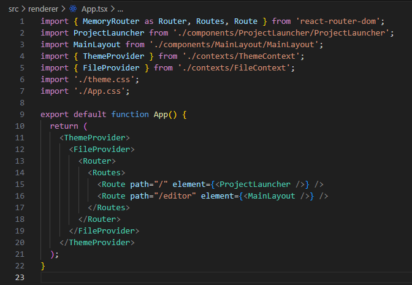
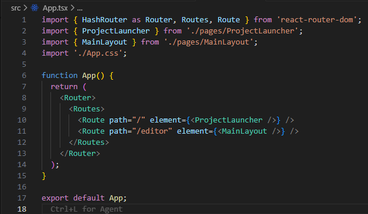
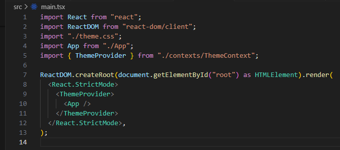
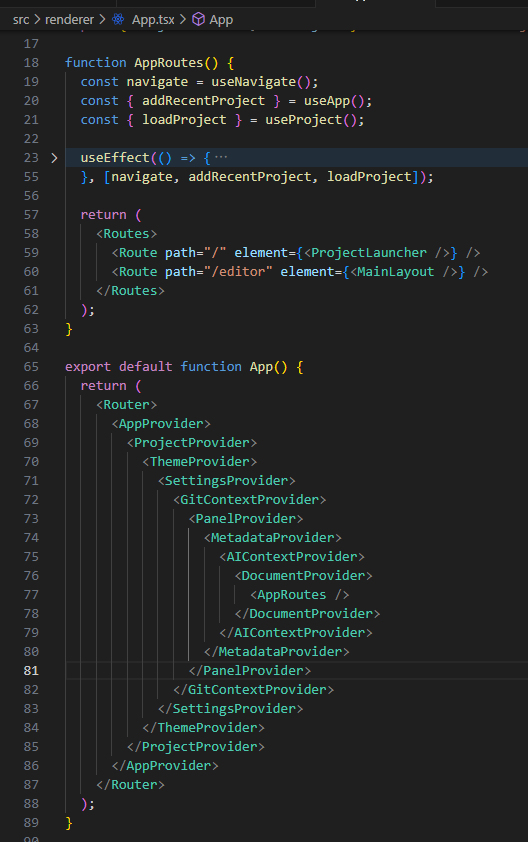

# 猫モフ Apps - 小説執筆アプリを創ろう - 07. Appを見てみよう


猫モフ Apps は、猫をモフモフしながら思いついたアイデアを、バイブコーディングでゆるっと創っていく企画です。  

前回までオレオレ小説執筆アプリが完成しました。  
WEB小説で言えば、短編を書き上げたと言っても過言ではないでしょう。
後は長編化するでも、別の短編を書くでも好きに料理してください。

今回からは、AI君が作った内容を確認したり、`novelaid-editor`の機能を紹介したりしながら適当に改造していきます。  
前回まではElectron版をメインにTauri版を補足していきましたが、今回からは適当に両方をとりあげつつ書いていきます。  
まあ、ぶっちゃけ両方並行して記事にするのが面倒になってきたのと、バイブコーディングのAIガチャで作業が進められているであろうことから、私の環境と皆さんでも作成されているアプリのソースコード自体はかなり異なる事が考えられるからです。  

そんなわけで、ここからはプログラム寄りの、私自身の備忘録的な内容がメインとなります。

## `App.tsx`の内容を見てみよう

アプリの開始地点となるのが、`App.tsx`です。  
Electron版では`src\renderer\App.tsx`、Tauri版では`src\App.tsx`となります。

  
Electron版  


Tauri版

作成方法は同じで、ほぼ同じ機能を持たせたため、かなり似たソースコードとなっています。  
ですが、同じようにしたわりには細々違っている部分もあります。
構造を確認しつつ、違いを見てみます。  
なお、各説明は割と大雑把にしかしません(できません)ので、詳しくは各自で調べて下さい。  

まず、ReactはHTMLのタグのように見える形でコンポーネント(Components)を定義します。  
この`App.tsx`部分は`<App>`タグの定義となります。  

### `<Router>`の違い

次に、`<Router>`ですが、これは、ページの切り替えを行う仕組みです。  
この`Router`ですが、どちらも１行目で定義が呼ばれていますが、実は少し違うものが使用されていますね。  
Electron版は`MemoryRouter`、Tauri版は`HashRouter`となっています。  
ちなみにオリジナル版は`MemoryRouter`を使用していました。  
これは、内部的なURLの扱いが異なるみたいで、それぞれ微妙に動作が異なるみたいです。  
特に、ブラウザアプリのように前へ戻るとかの動作を必要とする場合の違いがありそうですが、このアプリのようなデスクトップアプリの場合、`MemoryRouter`の方で良さそうです。  

### `Provider`はどこ？

Electron版の方だけ、Routerの外側に、`ThemeProvider`、`FileProvider`が含まれています。  
まず、この`Provider`ですが、Reactの機能で、Contextを子孫のコンポーネントに渡すための仕組みです。   
`ThemeProvider`は`ThemeContext`を提供します。
つまり、`FileProvider`は`FileContext`を提供します。  
`ThemeContext`は[03 表示テーマ](./03_表示テーマ.md)の回で作成した記憶があるはずです。

となると、やはり、Tauri版の方に作成した筈の`ThemeProvider(ThemeContext)`が見当たりません。


`main.tsx`

どうやら、`src/main.tsx`にProviderが配置されているようです。  
おそらく、Tauri版では`App.tsx`部分を本当にUIに関連する部分に絞るために分離しているのではないでしょうか？  
これは、基本的な設計部分によるので、今のところはそのままにしておきましょう。  

### オリジナルの`App.tsx`

  

では、今現在のオリジナルの`App.tsx`と見比べましょう。  
各種Providerがいっぱいあるのと、`AppRoutes`というコンポーネントが定義されているのがわかります。  
これは考え方的にはTauri版に近くなっていますので、Electron版にも`AppRoutes`を導入しておくことにします。
あ、`<Router>`を含めて変えた方が良さそうなので、`<AppRouter>`としてオリジナルの方も調整します。  
```TypeScript
function AppRoutes() {
  //useNavigateを使用する場合、Routerの中である必要性がある
  return (
    <Routes>
        <Route path="/" element={<ProjectLauncher />} />
        <Route path="/editor" element={<MainLayout />} />
    </Routes>
  );  
}
function AppRouter(){
  return (
    <Router>
      <AppRoutes />
    </Router>
  );
}
```
ちょっと問題があったため、二段構えで分離してみました。  
ちゃんとしたやり方があるのかもしれませんが、とりあえずこれで動くので良しとします。  

## 設定保存の準備

オリジナルの`App.tsx`の中に、`AppProvider`と`ProjectProvider`がありました。  
そこで、同じような構造を導入するべく、以下の仕様を`dev/アプリケーション仕様.md`に追記し、同じ内容をAIに読み込ませて実装してもらいます。

```markdown

## データおよび設定の構造、参照範囲等

AppContext、および、ProjectContextで管理する。

* アプリケーション設定
  + アプリケーションレベルの設定。
  + 永続化が必要な場合、標準的なアプリケーション設定の保存場所に保存される
* プロジェクト設定
  + 永続化が必要な場合、プロジェクト(フォルダー)内の`.novelaid-clone`ディレクトリ内に保存される。

の区分は必要

設定関連のファイル名

* `config.json`
  + 主にアプリケーション設定で半固定値に近いもの
* `settings.json`
  + ユーザー設定など、設定画面で変更するもの
* `session.json`
  + 最後に開いたプロジェクト名やファイル名等
* `state.json`
  + ウィンドウサイズとか？
  + そこそこ頻繁に変わる情報

それぞれ、アプリケーションレベルとプロジェクトレベルの区分で保持。
```

そして、出来上がった`App.tsx`がこちらです。

```TypeScript
export default function App() {
  return (
    <AppProvider>
      <ThemeProvider>
        <FileProvider>
          <AppRouter />
        </FileProvider>
      </ThemeProvider>
    </AppProvider>
  );
}
```
おや、`ProjectProvider`がありません。  
いや、そもそも、追加をお願いしたのは`AppContext`なのに、追加されたのは`AppProvider`となっています。  
これは、`Context`の配布者(`Provider`)という意味合いで、`Context`に対して`Provider`という名前のコンポーネントを作成しているデザインパターンとなっています。
そして、検索すると`MainLayout.tsx`に配置されていました。

```TypeScript
function MainLayout() {
  const location = useLocation();
  const projectPath = (location.state as any)?.projectPath || null;

  return (
    <ProjectProvider projectPath={projectPath}>
      <MainLayoutContent />
    </ProjectProvider>
  );
}
```
影響範囲としては悪くはないのですが、UIとProviderを分離するという目的からすると、ちょっと違う気がしますので直してもらっておきます。  

さて、今追加された`Provider`で提供される`Context`ですが、これは、`createContext`で作成した`Context`を`useContext`で取り出す事ができます。  
`<Provider>`で囲った内側限定ではありますが、順に受け渡す処理を書くことなく、必要な場所で必要なContextを取り出す事ができる仕組みです。  
今回、`AppContext`、`ProjectContext`と、各種設定読み書き用の準備をしたことで、今後は設定をこれらの`Context`経由でやり取りできるようになります。

## まとめ

今回はプロジェクトの起点となる`App.tsx`について見てみました。  
大分プログラム寄りの話になったので興味がない方も居たとは思います。  

しかし、私が一連の記事を書いているのも一旦ある程度の機能が出来上がった小説執筆アプリの構造の見直しなどを目的としていますので、今後の記事はこのような感じになります。

なお、既に前回までで小説執筆アプリの骨格は出来上がっていますので、今後は興味のありそうな記事だけ覗いて貰えれば幸いです。  

次回は`novelaid-edotor`で扱うファイルの種類などについて見ていきます。

## MORE

### `Router`

`Router`は、ページの切り替えを行う仕組みです。  
URLの扱いが微妙に異なる。
また、再読み込みをした時の動作も微妙に異なる。  
再読み込みはElectron版では開発環境からの実行ではメニューに再読み込みがあります。
Tauri版も含め、`Ctrl+R`で再読み込みできます。

* BrowserRouter
* HashRouter
    + 再読み込み時、各ページの先頭に戻る
    + `/`または`/editor`に遷移する
    + URLは'http://localhost:1420/#/editor'のような形で表示される
* MemoryRouter
    + 再読み込み時、起動時相当まで戻る
    + URLは 'http://localhost:1212/index.html' のような形で表示され、変化しない。

URL表示や戻る、進む機能は不要なのと、再読み込みで完全にリセットされる方が便利なので、`MemoryRouter`の方が良いと思います。

なお、URLの確認は開発者ツールのコンソールに`location.   href`を入力して確認可能。  

開発者ツールにReact用のツールを入れると、色々便利になります。  

https://react.dev/link/react-devtools

を参照して、拡張機能のインストールをすることでElectorn版の開発者ツールにComponentタブが追加されます。
Tauri版の開発者ツールは、ちょっと色々手順が要りそうなので保留です。

