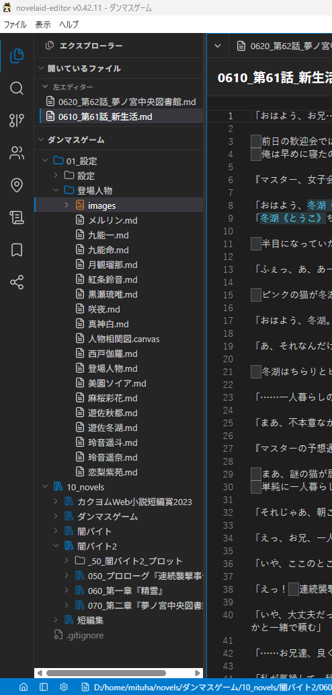
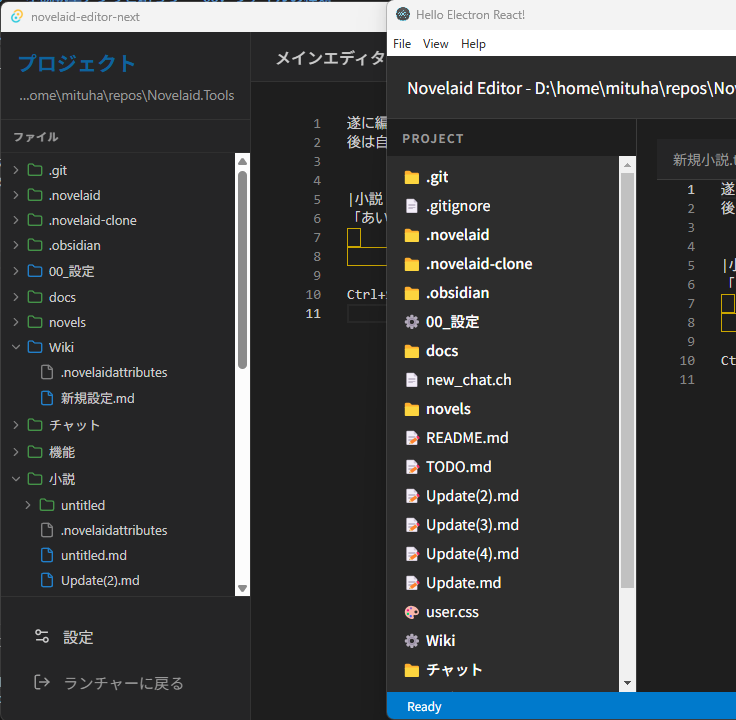

# 猫モフ Apps - 小説執筆アプリを創ろう - 08. ファイルの種類


猫モフ Apps は、猫をモフモフしながら思いついたアイデアを、バイブコーディングでゆるっと創っていく企画です。  

前回は少しプログラムの中身について見てみました。  
今後も少しづつ中身を見つつ機能を追加していきます。  

## ドキュメントの種類

  

ここで、私が実際に執筆に使用している時のフォルダー、ファイル構成を見てみます。  
設定用のファルダーと小説用のフォルダーを分けており、設定関連はマークダウンファイル(`.md`)で管理しています。  
なお、小説はテキストファイル(`.txt`)です。  
元々Obsidianで執筆していた時はマークダウンファイルでしたが、この執筆アプリを使用するようになってからはテキストファイルに戻しました。  

このように、オリジナルのアプリにおいてはファイルの種類をドキュメントタイプとして管理しており、表示のアイコン等も変更しています。  

今回はこの機能を同じように追加してみます。  
なお、テキストファイルしか使用しない！　というような場合は飛ばしてもらっても構いません。

### ドキュメントタイプの定義

毎度のことですが、以下の内容を`アプリケーション仕様.md`に追記し、同じ内容をAIに読み込ませて実装してもらいます。

```markdown

## ドキュメントタイプ

ドキュメントタイプとして、以下のような区分を導入します。

export type NovelaidDocumentType =
  | 'novel'
  | 'markdown'
  | 'image'
  | 'chat'
  | 'gitDiff'
  | 'browser'
  | 'css'
  | 'unknown';

ドキュメントタイプはファイルおよびフォルダーの種類を表します。  
ファイルエクスプローラーではこのドキュメントタイプに応じたアイコン、色で表示します。

```

  

出来上がったファイルエクスプローラーのアイコンの表示は上図のようになりました。  
左がTauri版、右がElectron版です。  

Tauri版のアイコンはオリジナルと同じく`lucide-react`のアイコンを使用しています。  
一方、Electron版は絵文字が使用されていました。  
折角なので、Electron版もアイコンライブラリを使用するように変更します。  
ただ、同じアイコンでも面白みがないため、`@phosphor-icons/react`のアイコンを使用してみます。  
と言いたかったのですが、ESM/CJS の互換性問題などで上手く動かなかったため、諦めました。

* `lucide-react`
  + [Lucide](https://lucide.dev/)
* `@phosphor-icons/react`
  + [Phosphor Icons](https://phosphoricons.com/)


## まとめ


## MORE

### ドキュメントアイコン(DocumentIcon)

ドキュメントアイコンは今後もあちこちで使用することが想定されます。  
この後、ドキュメントを複数タブで開くようにする場合等、タブヘッダーにもアイコンが欲しくなります。  
そこで、使い回しが効くように、ドキュメントアイコンをコンポーネントとして切り出しておきます。

```markdown

## ドキュメントアイコン(DocumentIcon)

ドキュメントタイプとファイル、フォルダーの区別等を渡して、アイコンを返すコンポーネントとします。
サイズも指定できるようにします。  

ファイルエクスプローラーやその他ファイルのアイコン表示を使用するところで共通で使用できるようにします。

```

上記を仕様に追加しつつ、実装してもらいます。  
このように、時々リファクタリングを挟みつつ改造を加えることで、少しずつコードの把握をしていきます。

## DocumentTypeの名前は避ける

元々、DocumentTypeという名前にしていたのですが、標準的なDOMの型と衝突してしまうため、NovelaidDocumentTypeに変更しました。
普通には問題なかったのですが、Tauri版でプラグイン作成時、DocumentTypeをプラグイン側で定義した際に発覚しました。

ついでに言うと、`gitDiff`の名称も元々は`git-diff`という名前でしたが、プラグインとして外部に出すにあたって名前の変換等で困ったため、`gitDiff`に変更しました。

## TODO 

`@phosphor-icons/react`はESM/CJS の互換性問題などで上手く動かせませんでした。  
なお、Tauri版では動作します。
JSONに以下を追加することで調整しようともしましたが、他で色々エラーが出たため、これも断念。  
```json
  "type": "module",
```
うん、やっぱり、Electron版はあきらめてTauri版の方が良さそうな気がしてきました。  
