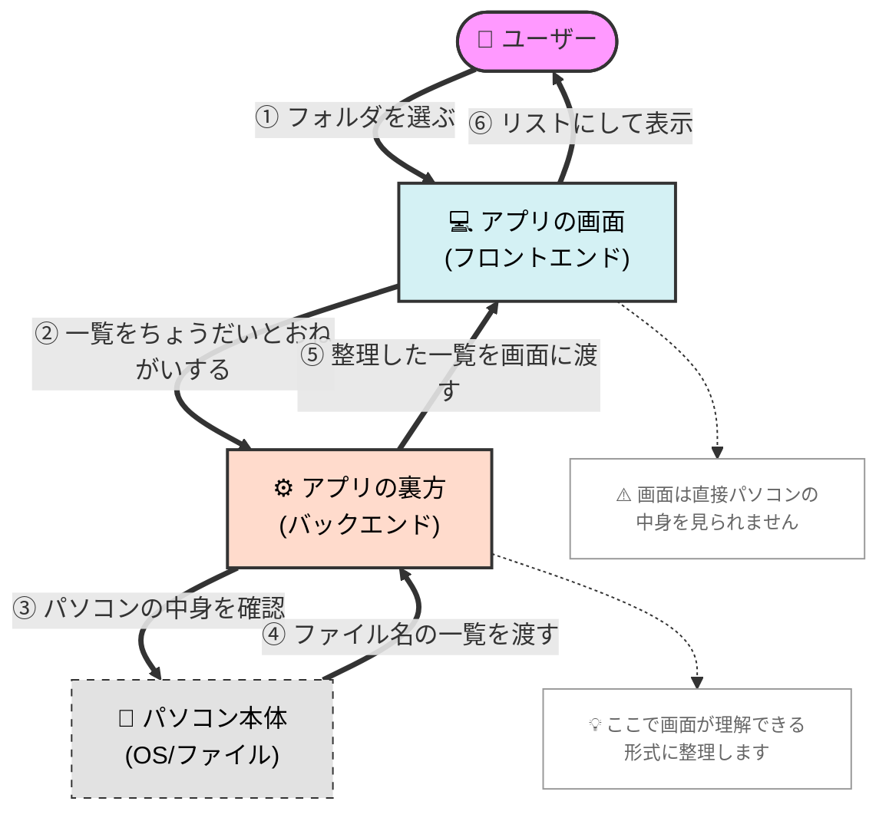
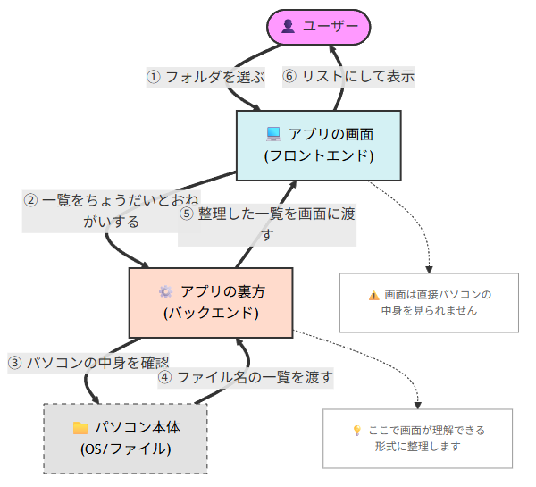

# 猫モフ Apps - 小説執筆アプリを創ろう - 09. バックエンド


猫モフ Apps は、猫をモフモフしながら思いついたアイデアを、バイブコーディングでゆるっと創っていく企画です。  

## フロントエンドとバックエンド

ElectronとTauriはどちらもWEBの技術でデスクトップアプリを構築するフレームワークです。  
そのため、フロントエンドとバックエンドが分離しています。  

フロントエンドはWEBブラウザで表示される部分です。  
今回はTypeScriptとReactを使用しています。  
ブラウザで表示される部分なので、ローカルなファイルシステムにアクセスすることはできません。  
そのため、ファイルシステムにアクセスする必要がある処理はバックエンドに実装します。  

バックエンド部分はElectronとTauriで実装方法が異なります。  
ElectronはNode.jsをバックエンドとして使用します。  
TauriはRustをバックエンドとして使用します。     


  

実際の`FileExplorer.tsx`は以下のようになっています。

```TypeScript
... 略

function FileExplorer({ projectPath }: FileExplorerProps) {

... 略

  useEffect(() => {
    const fetchFiles = async () => {
      if (projectPath && projectPath !== '未選択') {
        const fileList =
          await window.electron.ipcRenderer.listFiles(projectPath);
        setFiles(fileList);
      }
    };
    fetchFiles();
  }, [projectPath]);
```
Electron版では`await window.electron.ipcRenderer.listFiles(projectPath);`部分がバックエンドの呼び出しとなります。
```TypeScript
    listFiles: (directoryPath: string) =>
      ipcRenderer.invoke('list-files', directoryPath),
```
`listFiles`部分で`list-files`という名前で呼び出しを行っています。

```TypeScript
import { readDir } from '@tauri-apps/plugin-fs';

...略

export const FileExplorer: React.FC<FileExplorerProps> = ({ projectPath }) => {
    const [files, setFiles] = useState<FileNode[]>([]);
    const [loading, setLoading] = useState(true);
    const [error, setError] = useState<string | null>(null);
    const { openFile, activeFilePath } = useDocument();

    const loadFiles = async (path: string, parentType: DocumentType = 'novel'): Promise<FileNode[]> => {
        try {
            const entries = await readDir(path);
            const nodes: FileNode[] = entries.map(entry => {
```
Tauri版では`await readDir(path);`部分がバックエンドの呼び出しとなります。
が、プラグインとしてファイルシステムを操作するため、バックエンドの呼び出しは不要、というか、隠されています。  

なお、オリジナル版では次のような呼び出しになっていました。

```TypeScript
  const loadDirectory = useCallback(async () => {
    try {
      const fileList = await window.electron.ipcRenderer.invoke(
        'fs:readDirectory',
        file.path,
      );
      const sorted = (fileList as FileNode[]).sort((a, b) => {
        if (a.isDirectory === b.isDirectory)
```

Electron版のバックエンド側は、`src/main/preload.ts`のソースコードを確認してみてください。  

さて、折角なのでバックエンドの仕様についてもまとめておきたいところです。
まず、`docs/dev/バックエンド仕様.md`のファイルを作成します。

```
現在のバックエンドの仕様について、docs/dev/バックエンド仕様.md を更新してください
```

そして、AI君に上記のようにお願いしましょう。  
色々解析して、いい感じに仕様をまとめてくれたのではないでしょうか。

まとめてもらった仕様のIPC関連を抜粋してみます。

| チャンネル名 | 機能概要 | 引数 | 戻り値 |
| :--- | :--- | :--- | :--- |
| `get-app-path` | 特殊なディレクトリのパスを取得 | `name: string` (userData, home) | `string \| null` |
| `ensure-dir` | ディレクトリの存在確認と作成 | `directoryPath: string` | `boolean` |
| `read-json` | JSON ファイルを読み込む | `filePath: string` | `any` (存在しない場合は null) |
| `write-json` | JSON ファイルを書き込む | `filePath: string`, `data: any` | `boolean` |
| `select-directory`| フォルダ選択ダイアログを表示 | なし | `string \| null` (選択されたパス) |
| `list-files` | 指定パス内のファイル一覧を取得 | `directoryPath: string` | `{ name: string, isDirectory: boolean }[]` |
| `read-file` | テキストファイルを読み込む | `filePath: string` | `string` (UTF-8) |
| `write-file` | テキストファイルを書き込む | `filePath: string`, `content: string` | `boolean` |

既に色々やり取りを行っているのが分かります。  

ちなみにTauri版ではコマンド(IPCチャンネル)の追加は不要で、プラグインの範囲で対応されていました。

| プラグイン名 | 用途 | フロントエンドでの利用例 |
| :--- | :--- | :--- |
| `tauri-plugin-fs` | ファイル・ディレクトリ操作 | `readDir`, `readFile`, `writeFile`, `exists`, `mkdir` |
| `tauri-plugin-dialog` | ネイティブダイアログ | フォルダ選択 (`open({ directory: true })`) |
| `tauri-plugin-opener` | 外部連携 | ファイルまたはURLを既定のアプリで開く |

オリジナル版ではファイル操作関連以外にも色々追加されています。

*   `fs:*`: ファイルシステム関連
*   `metadata:*`: メタデータ・検索関連
*   `ai:*`: AI 関連
*   `git:*`: Git 関連
*   `calibration:*`: 解析・校正関連
*   `project:*` / `storage:*`: プロジェクト管理・設定関連

ファイルシステム系(`fs`)のコマンドは以下の通りです。

| チャネル | 引数 | 戻り値 | 説明 |
| :--- | :--- | :--- | :--- |
| `fs:readDirectory` | `dirPath: string` | `Promise<Dirent[]>` | ディレクトリ内容の読み取り。 |
| `fs:getDirectoryType` | `dirPath: string` | `Promise<DocumentType>` | ディレクトリの優先ドキュメントタイプを取得。 |
| `fs:getDocumentType` | `filePath: string` | `Promise<DocumentType>` | ファイルのドキュメントタイプを取得。 |
| `fs:readFile` | `filePath: string` | `Promise<string>` | テキストファイルの読み取り。 |
| `fs:writeFile` | `filePath: string, content: string` | `Promise<void>` | テキストファイルの保存。 |
| `fs:readDocument` | `filePath: string` | `Promise<any>` | メタデータを含むドキュメントの読み取り。 |
| `fs:saveDocument` | `filePath: string, data: any` | `Promise<void>` | メタデータを含むドキュメントの保存。 |
| `fs:createFile` | `filePath: string` | `Promise<boolean>` | 空ファイルの作成。 |
| `fs:createUntitledDocument` | `dirPath: string` | `Promise<string>` | 未命名ドキュメントの自動生成・保存。 |
| `fs:createDirectory` | `dirPath: string` | `Promise<boolean>` | ディレクトリの作成。 |
| `fs:rename` | `oldPath: string, newPath: string` | `Promise<boolean>` | ファイル・ディレクトリのリネーム。 |
| `fs:move` | `oldPath: string, newPath: string` | `Promise<boolean>` | 移動（競合時はダイアログ表示）。 |
| `fs:copy` | `srcPath: string, destPath: string` | `Promise<boolean>` | コピー（競合時はダイアログ表示）。 |
| `fs:delete` | `targetPath: string` | `Promise<boolean>` | 削除。 |

同じ機能のアプリを並行して開発しているので、流石にチャネル名と機能についてはオリジナル寄りで徐々に調整していきたいと思います。　　


## まとめ


## MORE


### チャネル or チャンネル？

今回、AIにバックエンド仕様を書いてもらったわけですが、IPCチャネルの表記がチャンネルとチャネルと混在しています。  
Electron版はチャンネル、Tauri版はチャネルと書かれています。  

Tauriの[公式サイト](https://v2.tauri.app/ja/develop/calling-frontend/
)では、

> チャネル Channels
>《訳注》 チャネル　「流路、伝送路」。日本語では一般に「チャンネル」と表記されますが、コンピュータ用語としては「チャネル」表記が一般的であるので、その表記に従って記述します。

とありました。  
また、Electronの公式サイトでは、チャンネルと表記されています。  

チャンネルは色々な意味で使われる言葉なので、IPCとしてはIPCチャネルと書いとこうかと思います。

