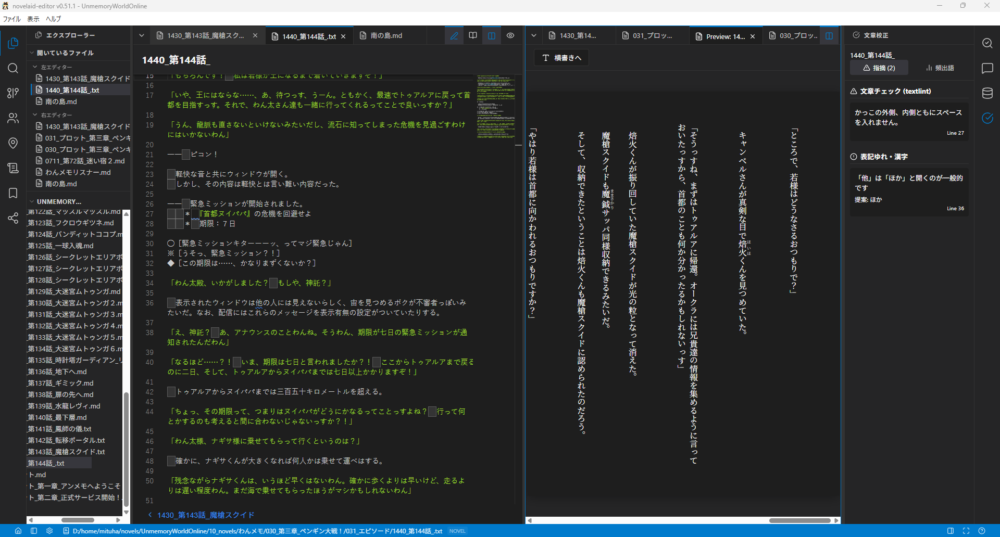

# 猫モフ Apps - 小説執筆アプリを創ろう - 10. ドキュメントエリア

猫モフ Apps は、猫をモフモフしながら思いついたアイデアを、バイブコーディングでゆるっと創っていく企画です。  

前回はフロントエンドとバックエンドについてで、プログラムの裏側寄りの話題でした。  
今回はもう少し表側、ユーザーが触れる部分の話題、と見せかけてまた構造的な話になります。

## ドキュメントエリア

オリジナル版の`novelaid-editor`のメイン画面は上の画像のようになっています。  
真ん中のエリアがドキュメントエリアです。  
ドキュメントエリアは左右に分割表示でき、それぞれタブで複数のドキュメントを開くことができます。

画像では左が執筆用のエディター画面で、右側にはプレビュー表示として縦書きでの表示を行っています。  

今回、このドキュメントエリアの機能の実装を行っていきます。
実装するのは、以下の２つの機能です。

1. 複数ドキュメントのタブ表示
2. ドキュメントの左右分割表示

