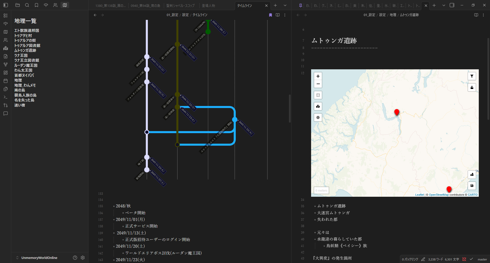
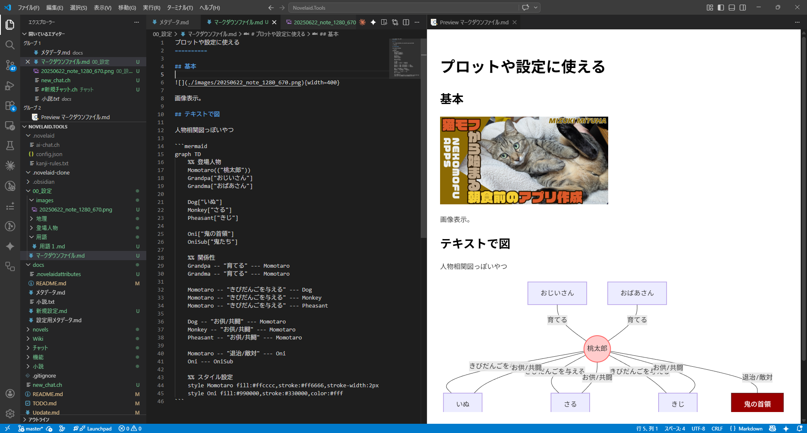
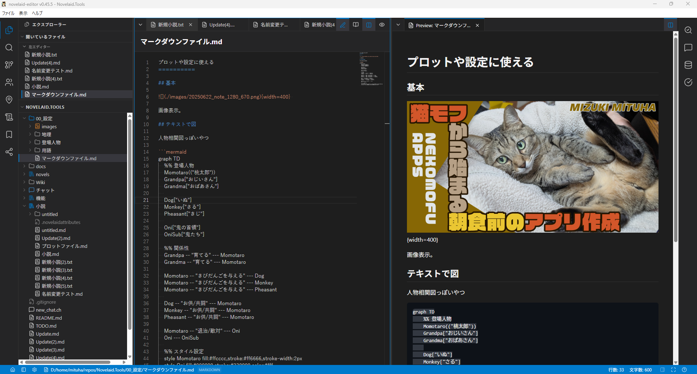
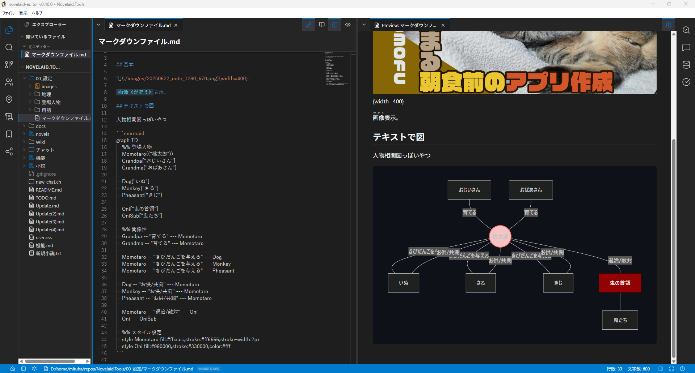
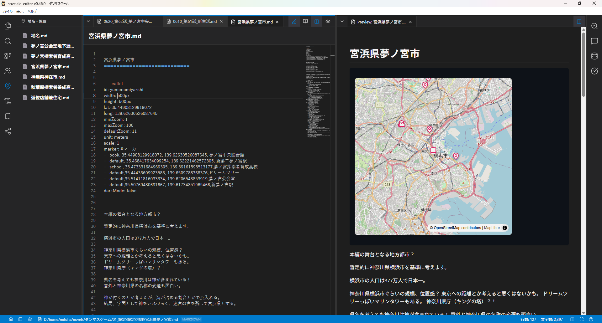
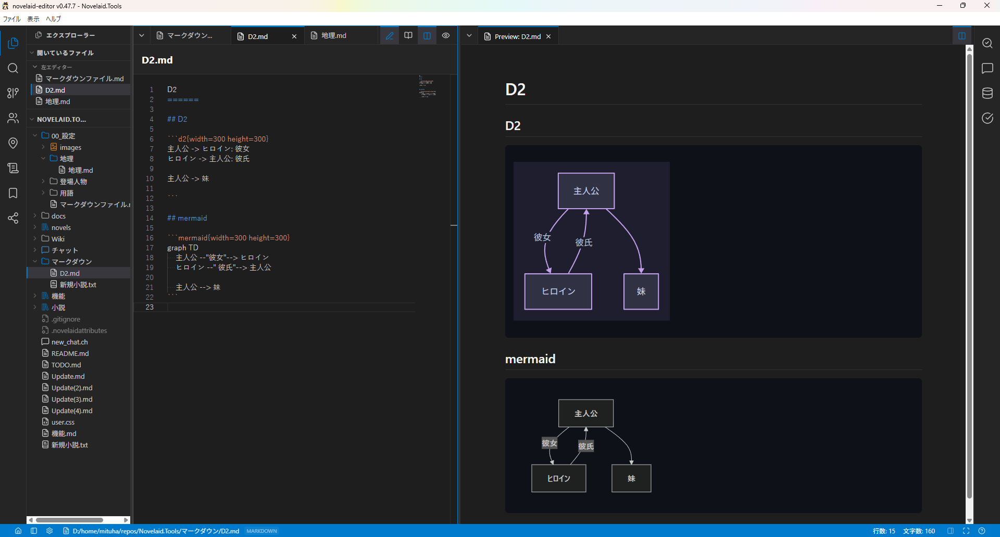

# 猫モフ Apps - 小説執筆アプリを創ろう - 13. マークダウン


猫モフ Apps は、猫をモフモフしながら思いついたアイデアを、バイブコーディングでゆるっと創っていく企画です。  

今回はマークダウンファイルのサポートについて見ていきます。

## マークダウンファイルの活用方法

  

これは私が設定用として書いているマークダウンファイルの表示です。  
なあ、この画面はObsidianの画面であって、自作の小説執筆アプリの画面ではありません。  

  

また、VSCodeですと、こんな感じです。

VSCode系のAntigravityでも[Markdown Preview Enhanced](https://open-vsx.org/extension/shd101wyy/markdown-preview-enhanced)という拡張機能を入れることでマークダウンファイル中に図を入れることが出来ます。

また、[Obsidian](https://obsidian.md/)でも標準で対応しているため、小説の設定等の整理にも使えます。  
プロットやら設定まとめるならObsidianがおすすめです。  

実際のところ、現在作成している小説執筆アプリと併用すれば便利に使用できます。
という事で、今回の記事はこれで終わり……というわけにもいかないので、自作の小説執筆アプリでもマークダウンファイルをサポートします。  

## マークダウンのサポート

  

実のところ、プレビュー表示で基本的なマークダウン表示は出来ています。  
多分ここまではAIに「マークダウンのプレビュー表示を追加して」と頼めば実装してくれることでしょう。

なので、今回はオリジナル版の`novelaid-editor`の方に`mermaid.js`による図の表示を追加していきます。

```markdown
## マークダウン表示

マークダウン表示時、コードブロックの内容などを独自の形式で処理できるような構造を追加します。
現在、カクヨム記法のルビ表示に対応しているが、どこでどのように処理しているかを確認。
これらの処理を共通化し、拡張しやすい構造にします。
これは、将来的にプラグインなどでの機能拡張を容易にするためです。

まず、ObsidianやVSCodeのMarkdown Preview Enhancedの拡張機能のように、marmeid.jsのコードブロックで図が表示できる機能の追加を検討します。

なお、コードは`src/novelaid-markdown/`以下に実装します。
```

TODOとして、上記内容で現状の調査と実装を行ってもらいます。
なお、事前に下記のようなフォルダー構成を作成しておきました。

```
src/novelaid-markdown/
│  index.ts
├─main
└─renderer
```

プラグイン的な構造の実装と配置変更により、以下のようになりました。

```
src/novelaid-markdown/
│  index.ts
│  registry.ts
│  types.ts
│
├─main
├─plugins
│      novel-syntax.ts
│
└─renderer
        BaseMarkdown.tsx
        MarkdownPreview.css
        MarkdownPreview.tsx
```

続けて`mermaid.js`への対応です。

  

事前にプラグイン的な仕組みを作成したおかげか、サクッと出来てしまいました。
折角なのでマップ表示も追加してみます。  

  

ライブラリとしては、`react-map-gl`、`maplibre-gl`を使用しています。  
書式としては、とりあえず、`obsidian-leaflet`で使用していた書式と最低限の互換をとってみました。
これで私の使用用途では`Obsidian`から移行しても問題なくなりました。  

思った以上にサクサク追加できたので、もう一つ。

  

[D2](https://d2lang.com/)にも対応しておきます。  
これは`mermaid.js`と同じように図を描くツールです。  
人物相関図を描く分には`mermaid.js`より使いやすいかもしれません。  
`mermaid.js`はガントチャートとかgitのブランチとか面白い図が描けますが、日本語の扱いが微妙なところもあるので。


